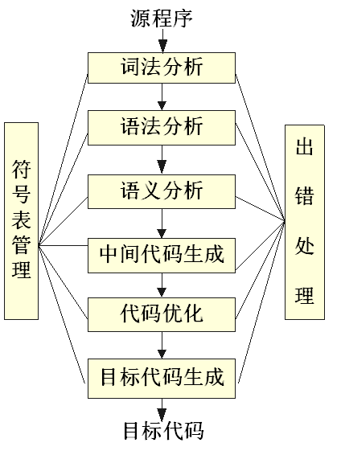
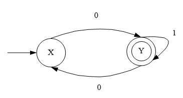
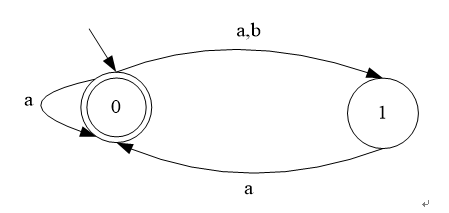
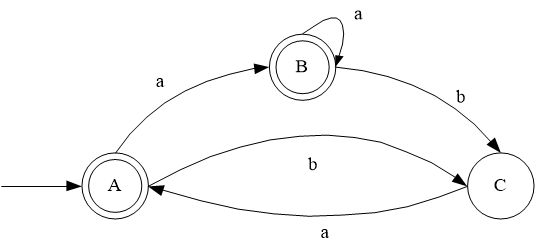
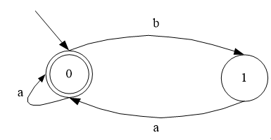
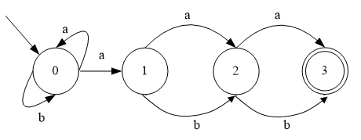
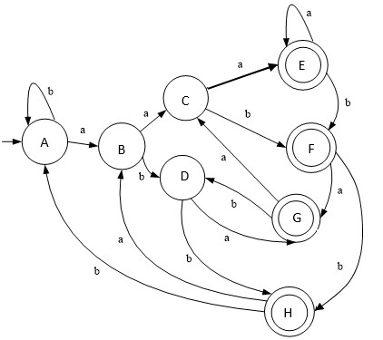

## 第一章引言作业

### 一. 单选题

1. 一个编译程序中,不仅包含词法分析,语法分析,中间代码生成,代码优化,目标代码生成等五个部分,还应包括______。

   A.模拟执行器

   B.解释器

   C.表格处理和出错处理

   D.符号执行器

   > 正确答案: C

2. 编译的各阶段工作中,__________和代码优化部分不是每个编译程序都必须的。

   A.语法分析

   B.中间代码生成

   C.词法分析

   D.目标代码生成

   > 正确答案: B

3. 词法分析器用于识别_________。

   A.字符串

   B.语句

   C.单词

   D.标识符

   > 正确答案: C

4. (单选题, 3分)
语法分析器则可以发现源程序中的________。

   A.语义错误

   B.语法和语义错误

   C.错误并校正

   D.语法错误

   > 正确答案: D

5. 下面关于解释程序的描述正确的是___________。

   (1) 解释程序的特点是处理程序时不产生目标代码

   (2) 解释程序适用于COBOL 和 FORTRAN 语言

   (3)  解释程序是为打开编译程序技术的僵局而开发的

   A.(1)(2)

   B.(1)

   C.(1)(2)(3)

   D.(2)(3)

   > 正确答案: B

6. _________的目的是使编译最后阶段产生的目标代码更为高效。

   A.中间代码生成

   B.目标代码生成

   C.词法分析

   D.语法分析

   E.代码优化

   > 正确答案: E

7. 与编译系统相比,解释系统____________。

   A.比较简单,可移植性好,执行速度快

   B.比较复杂,可移植性好,执行速度快

   C.比较简单,可移植性差,执行速度慢

   D.比较简单,可移植性好,执行速度慢

   > 正确答案: D

8. 解释程序处理语言时,大多数采用的是___________方法。

   A.源程序命令被逐个直接解释执行

   B.先将源程序转化为中间代码,再解释执行

   C.先将源程序解释转化为目标程序,再执行

   D.以上方法都可以

   > 正确答案: B

9. 编译过程中,语法分析器的任务就是__________。

   (1) 分析单词是怎样构成的

   (2) 分析单词串是如何构成语句和说明的

   (3) 分析语句和说明是如何构成程序的

   (4) 分析程序的结构

   A.(2)(3)

   B.(2)(3)(4)

   C.(1)(2)(3)

   D.(1)(2)(3)(4)

   > 正确答案: B

10. “用高级语言书写的源程序都必须通过编译,产生目标代码后才能投入运行”这种说法_________。

    A.不正确

    B.正确

    > 正确答案: A

11. 使用解释程序时,在程序未执行完的情况下,________重新执行已执行过的部分。

    A.也能

    B.不可能

    > 正确答案: A

### 二. 多选题

1. 要在某一台机器上为某种语言构造一个编译程序,必须掌握下述三方面的内容:_______,__________,_________。

   A.汇编语言

   B.高级语言

   C.源语言

   D.目标语言

   E.程序设计方法

   F.编译方法

   G.机器语言

   > 正确答案: CDF

### 三. 填空题

1. 汇编程序是将    翻译成    ,编译程序是将    翻译成    。

   > 正确答案：
   >
   > (1)汇编语言程序
   >
   > (2)机器语言程序
   >
   > (3)高级语言程序
   >
   > (4)低级语言程序;汇编语言程序和机器语言程序

2. 高级语言的语言处理程序分为解释程序和编译程序两种。编译程序有五个阶段,而解释程序通常缺少_______ 和_________。

   > 正确答案：
   >
   > (1)目标代码生成
   >
   > (2)代码优化

3. 由于受到具体机器主存容量的限制,编译程序几个不同阶段的工作往往被组合成_______,诸阶段的工作往往是_______进行的。

   > 正确答案：
   >
   > (1)遍
   >
   > (2)穿插

4. 在使用高级语言编程时,首先可通过编译程序发现源程序的全部__________错误和部分____________错误。

   > 正确答案：
   >
   > (1)语法
   >
   > (2)语义

5. 编译方式与解释方式的根本区别在于_______________。

   > 正确答案：
   >
   > (1)是否生成目标代码

6. 从功能上说,程序语言的语句大体可分为_____________和____________两大类。

   > 正确答案：
   >
   > (1)说明性语句;声明性语句;说明语句;声明语句
   >
   > (2)执行性语句;操作性语句;可执行语句;执行语句;操作语句

7. 扫描器(词法分析器)的任务是从____________中识别出一个个___________。

   > 正确答案：
   >
   > (1)源程序
   >
   > (2)单词;单词符号;记号

### 四. 简答题

1. 编译程序在逻辑上由哪几部分组成?

   > 正确答案：
   >
   > 答:词法分析,语法分析,语义分析,中间代码生成,中间代码优化,目标代码生成,符号表管理和出错处理。

2. 何谓编译的前端和后端?

   > 正确答案：
   >
   > 解答:前端主要由与源语言有关但与目标机无关的部分组成,通常包括词法分析、语法分析、语义分析与中间代码生成,有的代码优化工作也可包括在前端。后端包括编译程序中与目标机有关的部分,如与目标机有关的代码优化和目标代码生成等。通常,后端不依赖于源语言而仅仅依赖于中间语言。

3. 画出编译程序的总体结构图,简述各部分的主要功能。

   > 正确答案：
   >
   > 词法分析:输入源程序,进行词法分析,输出单词符号。
   >
   > 语法分析:对单词符号串进行语法分析(根据语法规则进行推导或规约),识别出各类语法单位,最终判断输入串是否构成语法上正确的“程序”。
   >
   > 语义分析与中间代码产生:按照语义规则对语法分析器规约出(或推导出)的语法单位进行语义分析并把它们翻译成一定形式的中间代码。
   >
   > 中间代码优化:对中间代码进行优化处理。
   >
   > 目标代码生成:把中间代码翻译成目标程序。
   >
   > 符号表管理:编译程序在工作中需要保持一系列的表格,以登记源程序的各类信息的编译中各阶段的进展状况。
   >
   > 出错处理:如果源程序中发现错误,编译器就将信息发送给用户。
   >
   > 

4. 试分析编译程序是否分遍应考虑的因素及多遍扫描编译程序的优缺点。

   > 正确答案：
   >
   > 解答:决定遍数的因素:(1)计算机存贮容量大小;(2)编译程序功能强弱;(3)源语言繁简;(4)目标程序优化程度;(5)设计和实现编译程序时使用工具的先进程度;(6)参加人员多少和素质等等。多遍扫描编译程序的优点:加工充分;出错处理细致;目标程序质量高;缺点:编译时间长,开销大。

### 五. 名词解释

1. 编译程序

   > 正确答案：
   >
   > 解答:编译程序是指一种能够把高级语言程序翻译成低级语言(汇编语言、机器语言)程序的程序。

2. 语义

   > 正确答案：
   >
   > 解答:一种语言的单词符号和语法单位的意义。

3. 语法

   > 正确答案：
   >
   > 解答:任何语言程序都可以看成是一定字符集(称为字母表)上的一个字符串(有限序列),并且一个程序语言只使用一个有限字符集作为字母表。所谓一个语言的语法是指这样的一组规则,用它可以形成和产生一个合式的程序。

4. 遍

   > 正确答案：
   >
   > 解答:遍就是对源程序或源程序的中间结构从头到尾扫描一次,并做有关的加工处理,生成新的中间结果或目标程序。

## 第二章词法分析作业

### 一. 单选题

1. 词法分析器用于识别              。

   A.句子

   B.句型

   C.单词

   D.产生式

   > 正确答案: C

2. 乔姆斯基（Chomsky）把文法分为四种类型，即0型、1型、2型、3型。其中3型文法是                   。

   A.短语文法

   B.正规文法

   C.上下文有关文法

   D.上下文无关文法

   > 正确答案: B

### 二. 多选题

1. 状态转换图如下所示，接受的字符集是              。

   

   A.以 0 开头的二进制数组成的集合

   B.以 0 结尾的二进制数组成的集合

   C.含奇数个 0 的二进制数组成的集合

   D.含偶数个 0 的二进制数组成的集合

   > 正确答案: AC

### 三. 填空题

1. 词法分析器的任务是从源程序中识别出一个个        。

   > 正确答案：
   >
   > (1)
   >
   >单词；记号；单词符号

2. 表示源程序中信息单元的字符序列叫做     。

   > 正确答案：
   >
   > (1)
   >
   > 记号

3. 有限字母表S上有限长度的字符串的集合叫做     。

   > 正确答案：
   >
   > (1)
   >
   > 语言

4. 确定有限自动机DFA是            的一个特例。

   > 正确答案：
   >
   > (1)
   >
   > NFA；不确定有限自动机；不确定有限状态自动机；不确定有限自动机NFA；不确定有限状态自动机NFA

5. (填空题, 4分)
   LEX源程序的三个组成部分        、       和       。

   > 正确答案：
   >
   > (1)
   >
   > 定义部分
   >
   > (2)
   >
   > 识别规则部分
   >
   > (3)
   >
   > 辅助函数部分

### 四. 判断题

1. 一个有限状态自动机中，有且仅有一个唯一的终态。

   A. 对

   B. 错

   > 正确答案: 错

2. 对任何正规表达式 e, 都存在一个 NFA M, 满足 L(M)=L(e) 。

   A. 对

   B. 错

   > 正确答案: 对

3. 如果有限自动机M1和M2接受相同的语言或者说它们识别同一个正规集，则称M1和M2等价。

   A. 对

   B. 错

   > 正确答案: 对

### 五. 简答题

1. 简要说明词法分析器的功能。

   > 正确答案：
   >
   > 解答：词法分析器的功能为依次扫描字符串形式的源程序中的各个字符，逐个识别出其中的单词，并将其转换为内部编码形式的单词符号串作为输出。

2. 简要叙述从正规式构造词法分析器的一般方法和过程。

   > 正确答案：
   >
   > 解答：从正规式构造词法分析器的一般方法和过程如下：
   >
   > （1）用正规式对模式进行描述；
   >
   > （2）为每一个正规式构造NFA；
   >
   > （3）将构造出的NFA转换成等价的DFA，这一过程也被成为确定化；
   >
   > （4）把DFA化为最简形式，这一过程也被成为最小化；
   >
   > （5）从简化后的DFA构造词法分析器。

3. 简述DFA与NFA有何区别?

   > 正确答案：
   >
   > 解答：DFA与NFA的区别表现为两个方面：一是NFA可以有ε转移，而DFA没有有ε转移。另一方面，DFA的状态转移move是从S×∑到S，而NFA的状态转移是从S×∑到S的幂集，即move将产生一个状态集合（可能为空集），而不是单个状态。

4. 叙述正规式(00 | 11) *( (01 | 10) (00 | 11)* (01 | 10) (00 | 11)* )*描述的语言。

   > 正确答案：
   >
   > 解答：该正规式所描述的语言是，所有由偶数个0和偶数个1构成的串。另外，和该正规式等价的正规式有( 00 | 11 | ( (01 | 10) (00 | 11) * (01 | 10) ) ) *。

5. 设A是任意的正规式，证明下述关系成立：

   （1）A|A=A

   （2）(A\*)\*=A\*

   （3）A\*=e|AA\*

   > 正确答案：
   >
   > 证明：
   >
   > （1）A|A=A
   >
   > 证明：设正规式A表示的正规集为L(A)
   >
   > 因为 L(A|A)=L(A)ÈL(A)=L(A)
   >
   > 所以 A|A=A
   >
   > （2）(A\*)\*=A\*
   >
   > 证明：因为(A\*)\*＝A\*\*，A\*\*＝A\*
   >
   > 所以(A\*)\*=A\*
   >
   > （3）A\*=e|AA\*
   >
   > 证明：因为AA\*= A+  A\*= A+|e=e| A+
   >
   > 所以A\*=e|AA\*

### 六. 名词解释

1. 正规式

   > 正确答案：
   >
   > 解答：又称正规表达式或正则表达式，是按照一组定义规则，由较简单的正规式构成的，每个正规式r表示一个语言L(r)。定义规则告诉我们L(r)是怎样以各种方式从r的子正规式所表示的语言组合而成的。

2. 非确定型有限自动机（NFA）

   > 正确答案：
   >
   > 解答：NFA是一个五元组M=（S, Σ, move, s0, F）
   >
   > （1）S 是一个有限的状态集合；
   >
   > （2）å（输入符号字母表）是一个输入符号的集合；
   >
   > （3）move：S×Σ→是一个状态转换函数，move(si, ch)=sj表示当前状态si下若遇到输入字符ch，则转移到状态sj；
   >
   > （4）状态s0是唯一的开始状态；
   >
   > （5）状态集合F是终态集（接受状态集合）,并且FÍS。

### 七. 计算题

1. 有NFA定义如下：N=(S={0，1}，S={a，b}，s0=0，F={0}，move={move(0,a)=0，move(0,a)=1，move(0,b)=1，move(1,a)=0})。

   （1）画出N的状态转换图；

   （2）构造N的最小DFA M；

   （3）给出M所接受语言的正规式描述；

   （4）举出语言中的三个串，并给出M识别它们的过程。

   > 正确答案：
   > 解答：
   >
   > （1）画出N的状态转换图
   >
   > 
   >
   > （2）构造N的最小DFA M
   >
   > 由子集法构造DFA：
   >
   > ε_闭包({0})= {0}                   A (初态，终态)
   >
   > ε_闭包(smove(A, a))= {0,1}  B（终态）
   >
   > ε_闭包(smove(A, b)) = {1}   C
   >
   > ε_闭包(smove(B, a)) = {0,1} B
   >
   > ε_闭包(smove(B, b)) = {1}    C
   >
   > ε_闭包(smove(C, a)) = {0}    A
   >
   > 则DFA M的如下所示：
   >
   > 
   >
   > 最小化DFA：
   >
   > 初始划分：π0={{A, B}, {C}};其中C自身一组，A和B分在一组。查看状态转移：
   >
   > move(A, a) = Bmove(A, b) = C
   >
   > move(B, a) = Bmove(B, b) = C
   >
   > 显然A和B不可区分，故合并为一个状态，选A为代表，并分别将A和C重新编号为0和1，得最小DFA如下图所示：
   >
   > 
   >
   > （3）给出M所接受语言的正规式描述；
   >
   > 解答：所接受的语言为：(a|ba) *
   >
   > （4）举出语言中的三个串，并给出M识别它们的过程。
   >
   > 解答：对于串ba、aaba、baa，最小DFA识别过程如下图所示：
   >

2. 设字母表S={a，b}，给出S上一个正规式 (a | b) *a (a | b) (a | b)。

   （1）构造该正规式所对应的NFA（画出转换图）；

   （2）将所求的NFA确定化（画出DFA的转换图）；

   （3）将所求的DFA最小化。

   > 正确答案：
   > (1)NFA如下：
   >
   > 
   >
   > （2）确定化：
   >
   > 利用子集构造法把上图的NFA确定化。
   >
   > NFA的开始状态是0，因此首先从NFA的状态集合{0}开始，它是DFA的开始状态，起名叫状态A。它的a转换和b转换所得到的NFA的状态集合见下面第一行。根据子集构造法所得的DFA的所有状态和它们的转换函数都列在下面。
   >
   > 状态A:{0}     smove ({0}, a) = {0, 1}B                  smove ({0}, b) = {0}A
   >
   > 状态B:{0,1}   smove ({0, 1}, a) = {0, 1, 2}C         smove ({0, 1}, b) = {0, 2}D
   >
   > 状态C:{0, 1, 2} smove ({0, 1, 2}, a) = {0,1,2,3}E    smove ({0, 1, 2}, b) = {0, 2,3}F
   >
   > 状态D:{0,2}   smove ({0, 2}, a) = {0, 1, 3}G        smove ({0, 2}, b) = {0, 3}H
   >
   > 状态E:{0,1,2,3} smove ({0,1,2,3}, a) = {0,1,2,3}E  smove ({0,1,2,3},b) = {0, 2,3}F
   >
   > 状态F:{0, 2, 3}  smove ({0, 2, 3}, a) = {0, 1, 3}G    smove ({0, 2, 3}, b) = {0, 3}H
   >
   > 状态G:{0, 1, 3} smove ({0, 1, 3}, a) = {0, 1, 2}C     smove ({0, 1, 3}, b) = {0, 2}D
   >
   > 状态H:{0, 3}     smove ({0, 3}, a) = {0, 1} B            smove ({0, 3}, b) = {0}A
   >
   > 状态E,F,G,H中都含原NFA的接受状态3，因此它们都是DFA的接受状态。最终所求FA如下图。
   >
   > 
   >
   > (3)最小化：
   >
   > 简要说明执行过程。
   >
   > 初始时将状态集分成两组：{A,B,C,D}和{E,F,G,H}。由于
   >
   > move (A, a) = B        move(A, b ) = A
   >
   > move(B, a) = C         move (B, b) = D
   >
   > move (C, a) = E         move (C, b) = F
   >
   > move (D, a) = G        move (D, b) = H
   >
   > move (E, a) = E         move (E, b) = F
   >
   > move (F, a) = G         move (F, b) = H
   >
   > move(G, a) = C         move (G, b) = D
   >
   > move(H, a) = B         move (H, b) = A
   >
   > 不能合并，所以原来的DFA已经是最简形式了。

3. 有限状态自动机 M 接受字母表S={0，1｝上所有满足下述条件的串：串中至少包含两个连续的 0 或两个连续的 1 。

   （1）请给出与 M 等价的正规式。

   （2）将 M 最小化。

   （3）构造与 M 等价的正规文法。

   > 正确答案：

## 第三章语法分析作业

### 一. 单选题

1. 一个句型中的最左     称为该句型的句柄。

   A.短语

   B.直接短语

   C.素短语

   D.终结符号

   > 正确答案: B

2. 有限自动机能识别       。

   A.上下文无关文法

   B.上下文有关文法

   C.正规文法

   D.短语文法

   > 正确答案: C

3. (单选题, 2.8分)由文法的开始符号S经一步或多步推导产生的文法符号序列是       。

   A.短语

   B.句柄

   C.句型

   D.句子

   > 正确答案: C

4. 文法G[E]： E→T∣E＋TT→F∣T\*FF→a∣（E）该文法句型E＋F\*(E＋T)的直接短语是下列符号串中的     。

   A.（E＋T）和F

   B.E＋T和F

   C.F和F\*(E＋T)

   D.F

   > 正确答案: B

5. 规范归约是指       。

   A.规范推导

   B.最右推导的逆过程

   C.最左推导的逆过程

   D.最左归约的逆过程

   > 正确答案: B

6. 在LR分析法中，分析栈中存放的状态是识别规范句型      的DFA状态。

   A.句柄

   B.前缀

   C.LR(0)项目

   D.活前缀

   > 正确答案: D

### 二. 填空题

1. 一个上下文无关文法所含的四个组成部分是     、     、     和     。

   > 正确答案：
   >
   > (1)一组终结符号
   >
   > (2)一组非终结符号
   >
   > (3)一个开始符号
   >
   > (4)一组产生式

2. 设G是一个给定的文法，S是文法的开始符号，如果S\*Þx（其中x∈（N∪T)\*），则称x是文法的一个    。

   > 正确答案：
   >
   > (1)句型

3. 设G是一个给定的文法，S是文法的开始符号，如果S\*Þx(其中x∈T\*)，则称x是文法的一个    。

   > 正确答案：
   >
   > (1)句子

4. 在语法分析中，最常见的两种方法一个是    分析法，另一个是   分析法。

   > 正确答案：
   >
   > (1)自上而下
   >
   > (2)自下而上

5. 在自上而下的语法分析中，应先消除文法的     递归，再消除文法的    递归。

   > 正确答案：
   >
   > (1)间接
   >
   > (2)直接

6. 规范归约是指在移进过程中，当发现栈顶呈现   时，就用相应产生式的    符号进行替换。

   > 正确答案：
   >
   > (1)句柄
   >
   > (2)左部

7. 自下而上的语法分析方法的基本思想是：从给定的终结符串开始，根据文法的规则一步一步的向上进行   ，试图    到文法的     。

   > 正确答案：
   >
   > (1)直接归约
   >
   > (2)归约
   >
   > (3)开始符号

8. 在LR（0）分析法的名称中，L的含义是    ，R的含义是    ，0 的含义是    。

   > 正确答案：
   >
   > (1)自左向右扫描输入串
   >
   > (2)最左归约
   >
   > (3)向后查看0个输入符号

### 三. 判断题

1. 语法分析之所以采用上下文无关文法是因为它的描述能力最强。

   A. 对

   B. 错

   > 正确答案: 错

2. 语法分析时必须先消除文法中的左递归。

   A. 对

   B. 错

   > 正确答案: 错

3. LR法是自上而下语法分析方法。

   A. 对

   B. 错

   > 正确答案: 错

4. 若一个句型中出现了某产生式的右部，则此右部一定是该句型的句柄。

   A. 对

   B. 错

   > 正确答案: 错

5. 一个句型的句柄一定是文法某产生式的右部。

   A. 对

   B. 错

   > 正确答案: 对

### 四. 简答题

1. 仿照最左推导和左句型的定义，试叙述最右推导和右句型的定义。

   > 正确答案：
   >
   > 解答：最右推导：在推导过程中，若每次直接推导均替换句型中最右边的非终结符，称为最右推导。右句型：由最右推导产生的句型被称为右句型。

2. 简述自上而下分析的宗旨。

   > 正确答案：
   >
   > 解答：自上而下分析的宗旨是：对给定输入串w，试图用一切可能的办法，从文法开始符号S出发，自上而下，从左到右地为输入串建立一棵以S为根结点的语法树。或者说，为输入串寻找最左推导S*Þw。这种分析过程本质上是一种试探过程，是反复使用不同的产生式谋求匹配输入串的过程。如果这一试探得到成功，则证明w是相应文法的一个句子，反之，则不是。

3. 试叙述递归下降法。

   > 正确答案：
   >
   > 解答：递归下降法是指对消除左递归和回溯以后的文法的每一非终结符号，都根据相应产生式各候选式的结构，为其编写一个子程序 (或函数)，用来识别该非终结符号所表示的语法范畴，由于文法的定义是递归的，因此这些过程也是递归的。

4. 根据程序错误性质可以分为哪几种错误？

   > 正确答案：
   >
   > 解答：程序错误根据性质来区分为以下几种。
   >
   >（1）词法错误，如标识符、关键字或算符的拼写错；
   >
   >（2）语法错误，如算术表达式的括号不配对；
   >
   >（3）语义错误，如算符作用于不相容的运算对象；
   >
   >（4）逻辑错误，如无穷的递归调用。

5. 自下而上分析法的思想。

   > 正确答案：
   >
   > 解答：自下而上分析法的思想就是从输入串开始，逐步进行“归约”，直至归约到文法的开始符号；或者说从语法树的末端开始，步步向上“归约”，直到根结点。

6. 简述自上而下分析器和自下而上分析器的基本动作。

   > 正确答案：
   >
   > 解答：自上而下分析器的动作如下：
   >
   >（1）若栈顶符号x是非终结符，查询分析表，找出一个以x作为左部的产生式，x出栈，并将其又不反序入栈，且输出带记下产生式编号——推导。
   >
   >（2）若栈顶符号x是终结符，且读头下的符号也是x，则x出栈，读头指向下一个符号——匹配。
   >
   >（3）若栈顶符号x是终结符，且读头下的符号不是x，则匹配失败。这说明可能前面推导时选错了候选式，退回到上次推导现场（包括栈顶指针、读头的指针）——回溯。
   >
   >（4）回溯后选取另一候选式进行推导，若没有候选是可选，则进一步回溯。若回溯到开始符号又已无候选式可选，则识别失败。
   >
   >（5）若栈内仅剩下“#”，且读头也指向“#”，则识别成功。
   >
   >自下而上分析器的基本动作是移进和归约，实际可能的动作还有两种，接受和报错。
   >
   >（1）移进动作把剩余输入中的下一个输入符号移进栈。
   >
   >（2）归约动作句柄在栈顶形成，用适当的产生式左部代替句柄
   >
   >（3）接受动作分析器宣告分析成功。
   >
   >（4）报错动作分析器发现语法错误，调用错误恢复例程。

7. 简述构造LR分析表的技术。

   > 正确答案：
   >
   > 解答：构造LR分析表的技术有以下四种：第一种方法也是最简单的一种，叫做LR(0)表构造法。这种方法局限性大，但是它是建立其他较一般的LR分析法的基础。第二种方法叫做简单LR表（SLR）构造法。虽然一些文法构造不出SLR分析表，但是，这是一种比较容易实现又极有使用价值的方法。第三种方法叫做规范LR表构造法，这种分析表能力最强，能够适应一大类文法，但是，实现代价过高。第四种方法叫做向前LR表（LALR）构造法。这种分析表的能力介于SLR和规范LR之间，可以高效地实现。

### 五. 名词解释

1. 上下文无关文法

   > 正确答案：
   >
   > 解答：上下文无关文法是一个四元组（N,T,P,S），其中：
   >
   >（1）T是一个非空有限集合，其元素称为终结符。在我们谈论程序设计语言的文法时，记号是终结符的同义词。
   >
   >（2）N是一个非空有限集合，其元素称为非终结符，并有T∩N = f。非终结符定义终结符串的集合，它们用来帮助定义由文法决定的语言。
   >
   >（3）S是非终结符，称为开始符号，它定义的终结符串集就是文法定义的语言。
   >
   >（4）P是产生式的有限集合，每个产生式的形式是A®a（有时用::=代替箭头），其中AÎN，被称为该产生式左部，a∈(T∪N )\*，被称为该产生式的右部。开始符号至少出现在某个产生式的左部。产生式指出了终结符和非终结符组成串的方式。

2. 句柄

   > 正确答案：
   >
   > 解答：一个句型的最左直接短语。

3. 活前缀

   > 正确答案：
   >
   > 解答：对于文法G[S]，若有S\*Þαβ，β∈T\* ，则称α为规范前缀，也称为活前缀。

### 六. 计算题

1. 给定文法：S→ (L)|b  L→L,S|S

   (1) 指出文法的开始符号、终结符、非终结符；

   (2) 为下述句子建立最左推导和最右推导，并给出它们最终的分析树；

   ① (b,b)    ② (b,(b,b))    ③ (b,(b,(b,b)))

   (3) 用自然语言描述该文法所产生的语言。

   > 正确答案：
   >
   > (1)解答：开始符号：S 终结符：( ) , b 非终结符：S L
   >
   > (2)解答：
   >
   > (b,b) 的最左推导：S=>(L)=>(L,S)=>(S,S)=>(b,S)=>(b,b)
   >
   > (b,b) 的最右推导：S=>(L)=>(L,S)=>(L,b)=>(S,b)=>(b,b)
   >
   > (b,(b,b)) 的最左推导：S=>(L)=> (L,S)=>(S,S)=>(b,S)=>(b,(L))=>(b,(L,S))=>(b,(S,S))=>(b,(b,S))=>(b,(b,b))
   >
   >(b,(b,b)) 的最右推导：S=>(L)=> (L,S)=>(L,(L))=>(L,(L,S))=>(L,(L,b))=>(L,(S,b))=>(L,(b,b))=>(S,(b,b))=>(b,(b,b))
   >
   > (b,((b,b),(b,b)))的最左推导：S=>(L)=>(L,S)=>(S,S)=>(b,S)=>(b,(L))=>(b,(L,S))=>(b,(S,S))=>(b,((L),S))=>(b,((L,S),S))=>(b,((S,S),S))=>(b,((b,S),S))=>(b,((b,b),S))=>(b,((b,b),(L)))=>(b,((b,b),(L,S)))=>(b,((b,b),(S,S)))=>(b,((b,b),(b,S)))=>(b,((b,b),(b,b)))
   >
   > (b,((b,b),(b,b)))的最右推导：S=>(L)=>(L,S)=>(L,(L))=>(L,(L,S))=>(L,(L,(L)))=>(L,(L,(L,S)))=>(L,(L,(L,b)))=>(L,(L,(S,b)))=>(L,(L,(b,b)))=>(L,(S,(b,b)))=>(L,((L),(b,b)))=>(L,((L,S),(b,b)))=>(L,((L,b),(b,b)))=>(L,((S,b),(b,b)))=>(L,((b,b),(b,b)))=>(S,((b,b),(b,b)))=>(b,((b,b),(b,b)))
   >
   > 其语法树如图所示:
   >
   >   (3)解答：该文法产生的语言是n元组，其中任何一元可为b或n元组(n=1,2,…)。

### 31. (计算题, 2.8分)已知文法G[S]：S → aAcB|BdA → AaB|cB → bScA|b(1) 试求句型 aAaBcbbdcc 和 aAcbBdcc 的句柄；(2)写出句子 acabcbbdcc 的最左推导过程。

- *正确答案：*

  解答：（1）解答：分别画出对应两句型的语法树如图所示,   对树（a），直接短语有3个：AaB, b和，而AaB为最左直接短语（即为句柄)。对树（b），直接短语有两个：Bd和c，而Bd为最左直接短语。(2) 解答：句子acabcbbdcc的最左推导如下：S=>aACB=>aAaBCB=>acaBcB=>aCabCB=>acabcbScA=>acabcbBdCA =>acabcbbdcA=>acabcbbdcc

### 32. (计算题, 2.8分)已知文法G[E]为：E→T|E+T|E-TT→F|T*F|T/FF→（E）|i（1）该文法的开始符号（识别符号）是什么？（2）请给出该文法的终结符号集合T和非终结符号集合N。（3）找出句型T+T*F+i的所有短语、简单短语和句柄。

- *正确答案：*

  解答：（1）解答：该文法的开始符号（识别符号）是E。（2）解答：该文法的终结符号集合T={+、-、*、/、（、）、i}。非终结符号集合N={E、T、F}。（3）解答：类似于上题解法可得句型T+T*F+i的短语为i、T*F、第一个T、T+T*F+i；简单短语为i、T*F、第一个T；句柄为第一个T。

### 33. (计算题, 2.8分)消除下列文法G[E]的左递归。 E→E-T∣TT→T/F∣FF→( E )∣i

- *正确答案：*

  解答：消除文法G[E]的左递归后得到：E→TE¢E¢→ -TE¢∣εT→FT¢T¢→/FT¢∣εF→( E )∣i

### 34. (计算题, 2.8分)将G[V]改造为 LL(1)文法。G[V]: V → N|N[E]E → V|V+EN → i

- *正确答案：*

  解答：LL(1)文法的基本条件是不含左递归和回溯（公共左因子），而文法G[V]中含有回溯，所以先消除回溯得到文法G¢ [V]：G¢ [V]：V→NV¢V¢→ε|（E）E→VE¢E¢→ε|+EN→i

### 35. (计算题, 2.8分)已知文法G[S]如下：S→aABe  A→b|Abc  B→d(1)  改写G[S]为等价的LL(1)文法；(2)求每个非终结符的FIRST集合和FOLLOW集合；(3)构造预测分析表；(4)写出对输入序列abcde、abcce、abbcde的分析过程。

- *正确答案：*

  (1)解答：改写后的文法G¢ [S]：S→aABe  A→bA¢  A¢→bcA¢|ε  B→d (2)解答：FIRST(S)= {a},    FOLLOW(S)={#}FIRST(A)={b},     FOLLOW(A)={d}FIRST(A¢) = {b,ε},  FOLLOW(A¢)={d}FIRST(B) = {d},    FOLLOW(B)={e}（3） abcde#SaABe     A bA¢    A¢ bcA¢ ε  B   d  (4)对abcde的分析: 对abcce的分析: 对abbcde的分析：

### 36. (计算题, 2.8分)设有文法G[S]：S→aAA→AbA→b求识别该文法所有活前缀的DFA。

- *正确答案：*

  解答：（1）首先拓广文法：在G中加入产生式0.S′→S，然后得到新的文法G′:S′→SS→aAA→AbA→b（2）再求G′的识别全部活前缀的DFA： 

### 37. (计算题, 2.8分)给定文法G[Z]： Z→C SC→if E thenS→A＝EE→E∨AE→AA→i其中：Z、C、S、A、E∈N ；   if、then、＝、∨、i∈T（1）构造此文法的LR(0)项目集规范族，并给出识别活前缀的DFA。（2）构造其SLR（1）分析表。 

- *正确答案：*

  解答：(1) 首先拓广文法：在G中加入产生式0．Z′→Z，然后得到新的文法G′，再求G′的识别全部活前缀的DFA：I0：Z′→.Z    Z→.CS    C→.if E thenI1：Z′→Z.I2：Z→C.S    S→.A＝E    A→.iI3：C→if .E then    E→.E∨A    E→.A    A→.iI4：Z→CS.I5：S→A.＝EI6：A→i.I7：C→if E .then    E→E.∨AI8：E→A.I9：S→A＝.E    E→.E∨A    E→.A    A→.iI10：C→if E then.I11：E→E∨.A     A→.iI12：S→A＝E.     E→E.∨AI13：E→E∨A.识别活前缀的DFA如图所示: (2)解答：Follow(Z)＝{#}Follow(C)＝{i}Follow(S)＝{#}Follow(E)＝{#,∨,then}Follow(A)＝{＝,#,∨,then}则可构造SLR（1）分析表如下所示： 
