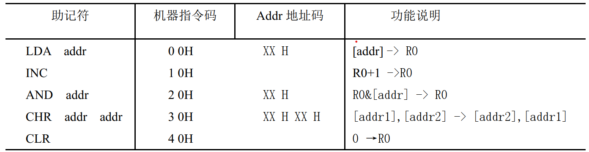
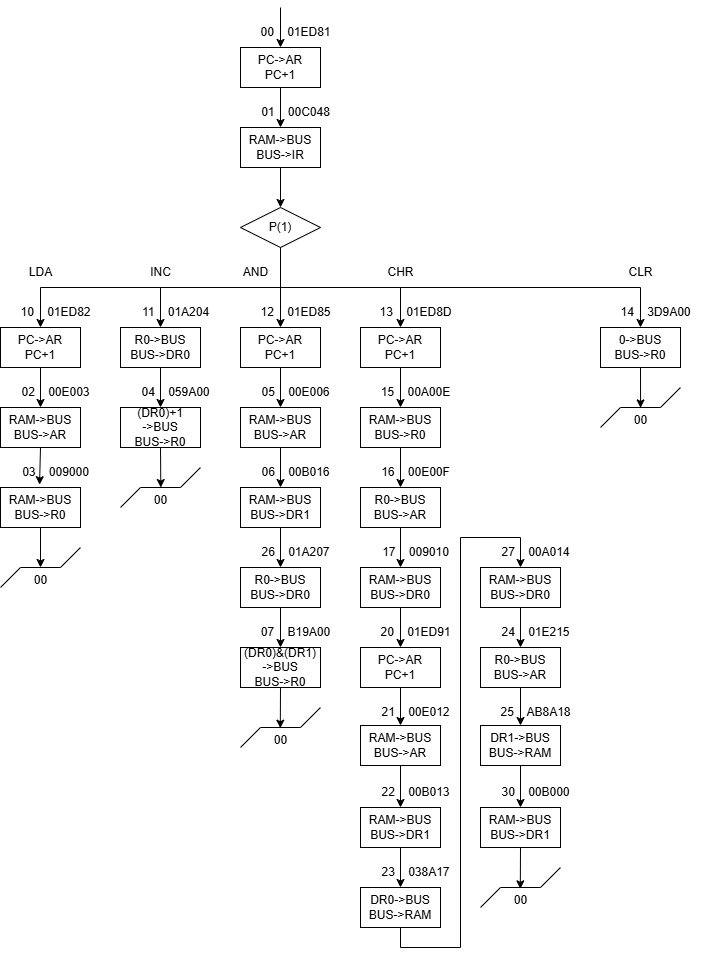
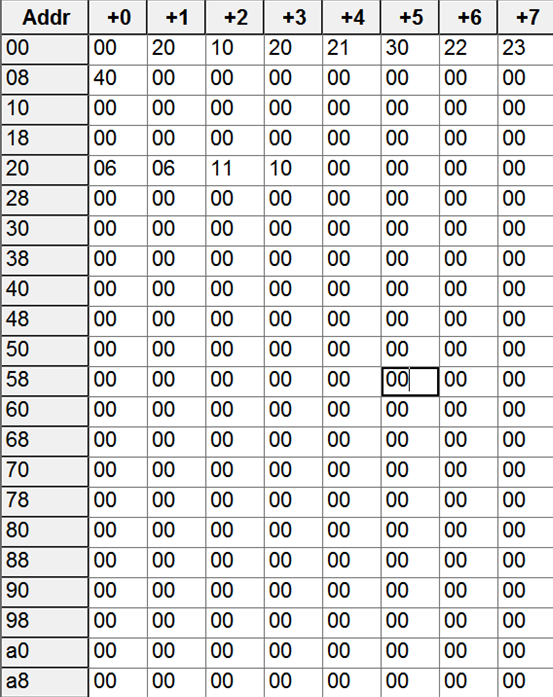

西电计组课设

## 实验设计

### 指令设计



### 流程图



### ROM 内容


### RAM 内容



## 实验结果

各指令进行顺序执行， 分别执行 `LDA`、 `INC`、 `AND`、 `CHR`、 `CLR`。

* 执行 `LDA`： 从地址 20 加载数据 06 到 R0
* 执行 `INC`： R0 数据进行自增变为 07
* 执行 `AND`： 从地址 21 加载数据 06 与 R0 中 07 做与运算得到结果 06 并存入 R0
* 执行 `CHR`： 分别从地址 22、 23 加载数据 11、 10， 并进行交换再存储回去， 最后地址 22 为
10， 地址 23 为 11， 为了验证操作的正确性， 存入之后又从 RAM 中读取
* 执行 `CLR`： 将 R0 进行清零

## 辅助代码设计

帮助设计 ROM 内容并自动翻译为 16 进制字符串打印输出

```python
from enum import Enum


class ROM:
    """
    ROM类，表示只读存储器
    """
    class AMode(str, Enum):
        LDR0 = '001'
        LDDR0 = '010'
        LDDR1 = '011'
        LDIR = '100'
        LDAD = '101'
        LDAR = '110'


    class BMode(str, Enum):
        RS_B = '001'
        ALU_B = '101'
        PC_B = '110'

    
    class CMode(str, Enum):
        P1 = '001'
        P4 = '100'
        LDAR = '101'
        LDPC = '110'


    def __init__(self, len_ROM: str, blank_char: str = 'X') -> None:
        """
        初始化 ROM 类

        :param len_ROM: ROM 的长度，八进制字符串
        :param blank_char: 空白字符，默认为 'X'
        :return: None
        """
        self.len_ROM = int(len_ROM, 8)
        self.blank_char = blank_char
        self.S_M_CN = [blank_char * 6 for _ in range(self.len_ROM)]  # 运算器相关信号 6位
        self.WE = [blank_char for _ in range(self.len_ROM)]  # 1位
        self.A9A8 = [blank_char * 2 for _ in range(self.len_ROM)]  # 2位
        self.A = [blank_char * 3 for _ in range(self.len_ROM)]  # 3位
        self.B = [blank_char * 3 for _ in range(self.len_ROM)]  # 3位
        self.C = [blank_char * 3 for _ in range(self.len_ROM)]  # 3位
        self.UA = [blank_char * 6 for _ in range(self.len_ROM)]  # 下一条指令的地址 6位

    def set(self,
            index: str,
            S_M_CN: str | None = None,
            WE: str | None = None,
            A9A8: str | None = None,
            A: AMode | str | None = None,
            B: BMode | str | None = None,
            C: CMode | str | None = None,
            UA: str | None = None) -> None:
        """
        设置各个部分的指令
        """
        if S_M_CN is not None and len(S_M_CN) == 6:
            self.S_M_CN[int(index, 8)] = S_M_CN

        if WE is not None and len(WE) == 1:
            self.WE[int(index, 8)] = WE

        if A9A8 is not None and len(A9A8) == 2:
            self.A9A8[int(index, 8)] = A9A8

        if A is not None:
            if isinstance(A, self.AMode):
                self.A[int(index, 8)] = A.value
            elif len(A) == 3:
                self.A[int(index, 8)] = A

        if B is not None:
            if isinstance(B, self.BMode):
                self.B[int(index, 8)] = B.value
            elif len(B) == 3:
                self.B[int(index, 8)] = B

        if C is not None:
            if isinstance(C, self.CMode):
                self.C[int(index, 8)] = C.value
            elif len(C) == 3:
                self.C[int(index, 8)] = C

        if UA is not None and len(UA) == 6:
            self.UA[int(index, 8)] = UA

    def __set_whole_one16(self, index: str, whole: str) -> None:
        """
        设置一整条的指令

        :param index: 指令地址
        :param whole: 16进制字符串
        :return: None
        """
        whole = bin(int(whole, 16))[2:].zfill(24)
        self.S_M_CN[int(index, 8)] = whole[0:6]
        self.WE[int(index, 8)] = whole[6:7]
        self.A9A8[int(index, 8)] = whole[7:9]
        self.A[int(index, 8)] = whole[9:12]
        self.B[int(index, 8)] = whole[12:15]
        self.C[int(index, 8)] = whole[15:18]
        self.UA[int(index, 8)] = whole[18:24]

    def __setitem__(self, index: str, whole: str) -> None:
        """
        设置一整条的指令

        :param index: 指令地址
        :param whole: 16进制字符串
        :return: None
        """
        self.__set_whole_one16(index, whole)

    def get2expiain(self, index: str) -> str:
        """
        获取2进制字符串并解释

        :param index: 指令地址，八进制字符串
        :return: 解释字符串
        """
        return 'S_M_CN: ' + self.S_M_CN[int(index, 8)] \
            + ', WE: ' + self.WE[int(index, 8)] \
            + ', A9A8: ' + self.A9A8[int(index, 8)] \
            + ', A: ' + self.A[int(index, 8)] \
            + ', B: ' + self.B[int(index, 8)] \
            + ', C: ' + self.C[int(index, 8)] \
            + ', UA: ' + self.UA[int(index, 8)]
    
    def print2expiain_all(self) -> None:
        """
        打印所有2进制字符串并解释

        :return: None
        """
        for i in range(self.len_ROM):
            print(f'地址{oct(i)[2:]:02}: {self.get2expiain(oct(i)[2:])}')

    def __get2(self, index: str) -> str:
        """
        获取2进制字符串

        :param index: 指令地址，八进制字符串
        :return: 2进制字符串
        """
        return self.S_M_CN[int(index, 8)] \
            + self.WE[int(index, 8)] \
            + self.A9A8[int(index, 8)] \
            + self.A[int(index, 8)] \
            + self.B[int(index, 8)] \
            + self.C[int(index, 8)] \
            + self.UA[int(index, 8)]

    def __get16(self, index: str) -> str:
        """
        获取16进制字符串

        :param index: 指令地址，八进制字符串
        :return: 16进制字符串
        """
        return hex(int(self.__get2(index), 2))[2:].zfill(6).upper() if self.__get2(index).count('X') == 0 else 'XXXXXX'
    
    def __getitem__(self, index: str) -> str:
        """
        获取16进制字符串

        :param index: 指令地址，八进制字符串
        :return: 16进制字符串
        """
        return self.__get16(index)

    def print16_all(self) -> None:
        """
        打印所有16进制字符串

        :return: None
        """
        for i in range(self.len_ROM):
            print(f'地址{oct(i)[2:]:02}: {self[oct(i)[2:]]}')
```

示例：

```python
rom = ROM('27')
# 00
rom['00'] = '01E801'
# 01
rom['01'] = '00C048'
# 02
rom['02'] = '00E003'
# 03
rom['03'] = '009000'
# 04
rom['04'] = '059A00'
# 05
rom['05'] = '00E006'
# 06
rom['06'] = rom['02']
rom.set('06', A='011')
rom.set('06', UA='010110')
# 07
rom['07'] = 'B19A00'
# 10
rom['10'] = '01ED82'
# 11
rom['11'] = '01A204'
# 12
rom['12'] = '01ED85'
# 13
rom['13'] = '01ED8D'
# 14
rom['14'] = '359A00'
# 15
rom['15'] = '00900E'
# 16
rom['16'] = '01A20F'
# 17
rom['17'] = rom['02']
rom.set('17', A='010')
rom.set('17', UA='010000')
# 20
rom['20'] = '01ED90'
# 21
rom['21'] = '00E012'
# 22
rom['22'] = rom['17']
rom.set('22', A='011')
rom.set('22', UA='010011')
# 23
rom['23'] = '038201'  # from old '15'
rom.set('23', S_M_CN='000000')
rom.set('23', B='101')
rom.set('23', UA='010100')
# 24
rom['24'] = rom['16']
rom.set('24', UA='010101')
# 25
rom['25'] = rom['23']
rom.set('25', S_M_CN='101010')
rom.set('25', UA='000000')
# 26
rom['26'] = rom['11']
rom.set('26', UA='000111')

rom.print16_all()
rom.print2expiain_all()
```
