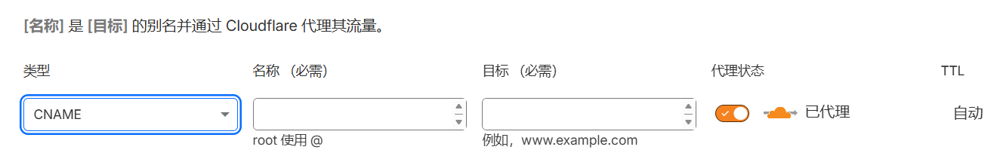

---

## 介绍

GitHub Pages 允许用户使用自定义域名来访问他们的站点，而不是使用默认的 `username.github.io` 或 `organization.github.io` 域名。本文将介绍如何购买域名并将自定义域名绑定到 GitHub Pages 站点。

## 步骤

1. 确定域名

   首先，确定你想要取的二级域名，取自己喜欢的就可以，这里就拿`example`举例。

   其次，确定你想要使用的一级域名，这里有很多选择，比较便宜的有`.cn`、`.top`、`.cc`等等，当然也可以取`.com`这样的域名。

   `.cn`只能在国内注册，后续流程也比较麻烦或许（听说需要实名认证之类的）。

   `.top`因为过于便宜，经常被滥用，可能会被某些服务拦截。

   因此这里我们就拿`.cc`举例，最终我们要注册的域名就是`example.cc`。

   去任意一个域名注册商网站（下文会提到），搜索你想要的域名是否可用，有的网站收录不全，比如`.cn`只能在国内查询，可以多试试，如果已经被注册，可以考虑更换二级域名或者一级域名，直到未被注册。

2. 购买域名

   选择一个域名注册商并购买你想要的域名。

   对于`.cc`域名，以下是一些常见的注册商及其价格（取自2026-01-08日数据）：

   | 域名注册商                                   | 价格   | 备注             |
   | -------------------------------------------- | ------ | ---------------- |
   | `namesilo`                                   | $9.99  |                  |
   | `dynadot`                                    | $8.8   |                  |
   | `cloudflare`                                 | $8     | 国内无法直接支付 |
   | [`spaceship`](https://www.spaceship.com/zh/) | $8.26  | 支持 alipay      |
   | `porkbun`                                    | $8.55  |                  |
   | `namecheap`                                  | $10.98 |                  |
   | `阿里云`                                     | ￥80   |                  |

   最终，考虑价格和便利性后，作者这里选择了`spaceship`注册商。

   直接访问`spaceship`官网，注册账号、完善信息、购买域名即可。

3. 使用 Cloudflare 托管

    为了方便管理 DNS 记录，建议使用 Cloudflare 来托管域名。

    首先在`spaceship`购买域名结束后，页面中会有一个`解封`按钮，点击后开始配置域名。

    看完介绍视频后，在`连接到example.cc`页面选择`自定义名称服务器`，准备配置 DNS。
  
    注册并登录 Cloudflare 账号，添加你购买的域名到 Cloudflare，注意选择免费计划。
  
    按照 Cloudflare 的指示，修改域名注册商处的域名服务器（Nameservers）为 Cloudflare 提供的服务器地址。

    注：Cloudflare 会自动进行`ssl`证书配置，也就是说可以通过`https`访问你的域名。

4. 绑定 Github Pages

   首先回到 Cloudflare，点击`域`->`example.cc`->`DNS`->`记录`，除了类型为`NS`的两条记录，其他的全部删除，点击`添加记录`：

   

   添加以下两条记录(这里假设 Github Pages 的域名是`username.github.io`)并点击`保存`：

   | 类型    | 名称  | 目标                  |
   | ------- | ----- | --------------------- |
   | `CNAME` | `@`   | `username.github.io`  |
   | `CNAME` | `www` | `username.github.io`  |

   回到 GitHub 仓库，进入`Settings`->`Github Pages`，在`Custom domain`输入框中输入你的自定义域名`example.cc`，点击`Save`保存。

   Github 会自动进行 DNS 检查，但其实无关紧要，现在已经可以访问你的自定义域名了，如果不行，尝试清除浏览器缓存或等待 DNS 生效。
