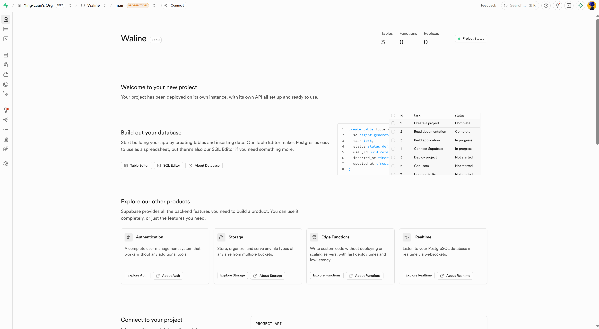
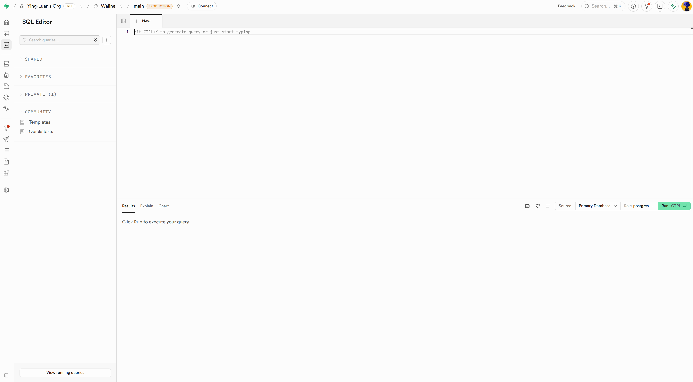
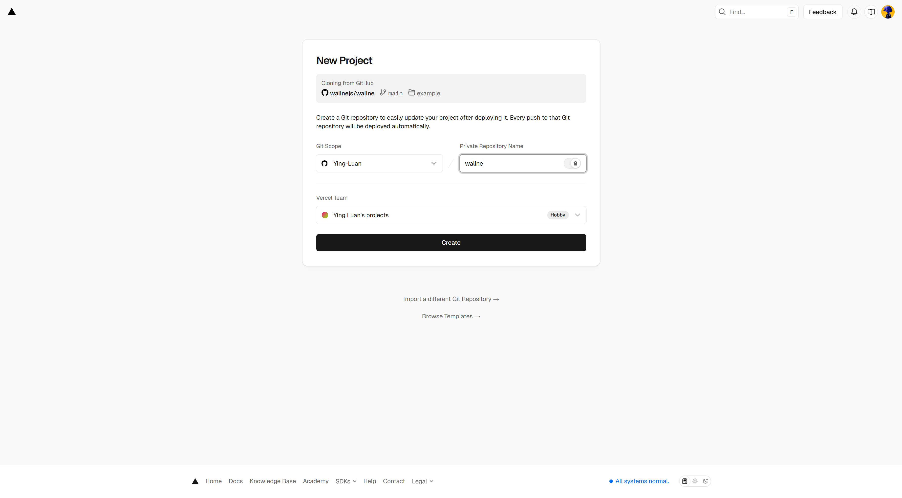
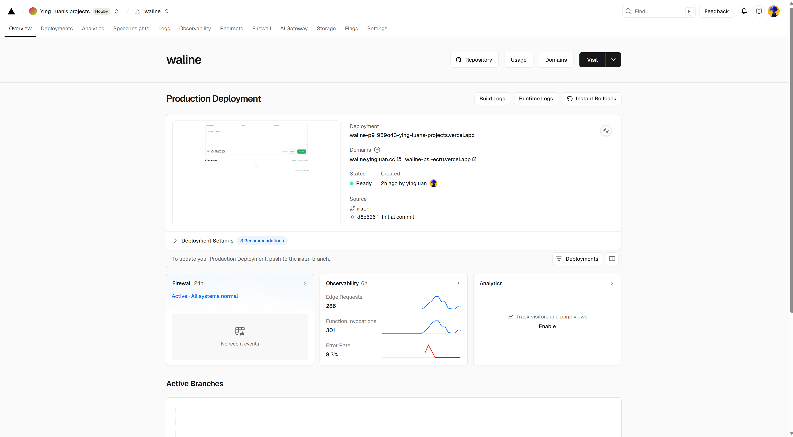

---

## 介绍

`Waline` 是一款简洁、安全的评论系统，默认支持`LeanCloud`，但是`LeanCloud`目前个人账户已无法注册，需要使用其他的数据库服务。本文介绍如何使用`Supabase`作为数据库，并将`Waline`部署到`Vercel`上，搭建一个免费的个人评论系统。

## 步骤

1. 创建`Supabase`数据库

   访问[Supabase 官网](https://supabase.com/)，一路注册并登录账号、创建组织、创建项目(密码使用自动生成的即可，保存好，服务器区域可选择新加坡)，直到以下页面：

   

   点击左侧侧边栏第三个图标`SQL EDITOR`，进入 SQL 编辑器页面：

   

   将[waline.pgsql](https://github.com/walinejs/waline/blob/main/assets/waline.pgsql)中的 SQL 脚本复制到编辑器中，点击运行按钮，创建数据库表。

   回到首页，点击最上端的`Connect`按钮，在`Connecting String`选项卡中，将`Method`改为`Session Pooler`，下方会出现相关指令，点击`View parameters`，挂起，一会要用到。

2. 创建`Vercel`项目

   访问[Vercel 官网](https://vercel.com/)，注册并登录账号，一路直到进入控制台页面。

   直接访问[Deploy](https://vercel.com/new/clone?repository-url=https%3A%2F%2Fgithub.com%2Fwalinejs%2Fwaline%2Ftree%2Fmain%2Fexample)，使用`Github`，仓库名任取，会自动创建，点击`Create`即可。

   

   等待部署成功，进入控制台页面。

   

   点击顶部的`Settings`->`Environment Variables`，添加以下环境变量：

   | Key           | 对应`Supabase`中的变量             |
   | ------------- | ---------------------------------- |
   | `PG_HOST`     | `host`                             |
   | `PG_PORT`     | `port`                             |
   | `PG_DB`       | `database`                         |
   | `PG_USER`     | `user`                             |
   | `PG_PASSWORD` | 之前`Supabase`创建项目时保存的密码 |

   添加完成后，右下角会出现`Redeploy`按钮，点击重新部署项目，或者点击顶部`Deployments`，选择最新的部署，点击右侧三个点中的`Redeploy`。

3. 使用

   在`Vercel`顶部`Overview`页面，可以看到部署成功的`Domains`，点击访问即可，也可以点击加号添加自定义域名(注意：自定义域名管理界面必须关闭对应的域名代理)。

   假设`Domains`为`example.vercel.app`，则`example.vercel.app`即为你的waline主页，`example.vercel.app/ui`即为管理界面，注册用户，第一个用户即为管理员。

4. 设置定时任务防止`Supabase`休眠

   由于`Supabase`的免费套餐会在一段时间不使用后进入休眠状态，导致评论系统无法正常工作，可以通过设置定时任务定期访问数据库来防止休眠。

   可以使用`GitHub Actions`来实现，在工作流文件中添加以下内容即可(需要手动添加环境变量`SUPABASE_KEY`和`SUPABASE_URL`，并且这里提供的配置可以自行扩展)：

   ```yaml
   name: Keep Supabase Alive

   on:
     workflow_dispatch:
     schedule:
       - cron: "33 23 * * *"

   jobs:
     keep-supabase-alive:
       name: Keep Supabase Alive
       runs-on: ubuntu-latest
       env:
         SUPABASE_KEY: ${{ secrets.SUPABASE_KEY }}
         SUPABASE_URL: ${{ secrets.SUPABASE_URL }}
       
       steps:
         - name: Keep Supabase Alive
           id: supabase
           run: |
             status_code=$(curl -s -o /dev/null -w "%{http_code}" -H "apikey: $SUPABASE_KEY" "$SUPABASE_URL/auth/v1/health")
             echo "status_code=$status_code" >> $GITHUB_OUTPUT
   ```

## 参考

* [Waline 官方文档](https://waline.js.org/guide/)
* [Supabase 官网](https://supabase.com/)
* [Vercel 官网](https://vercel.com/)
